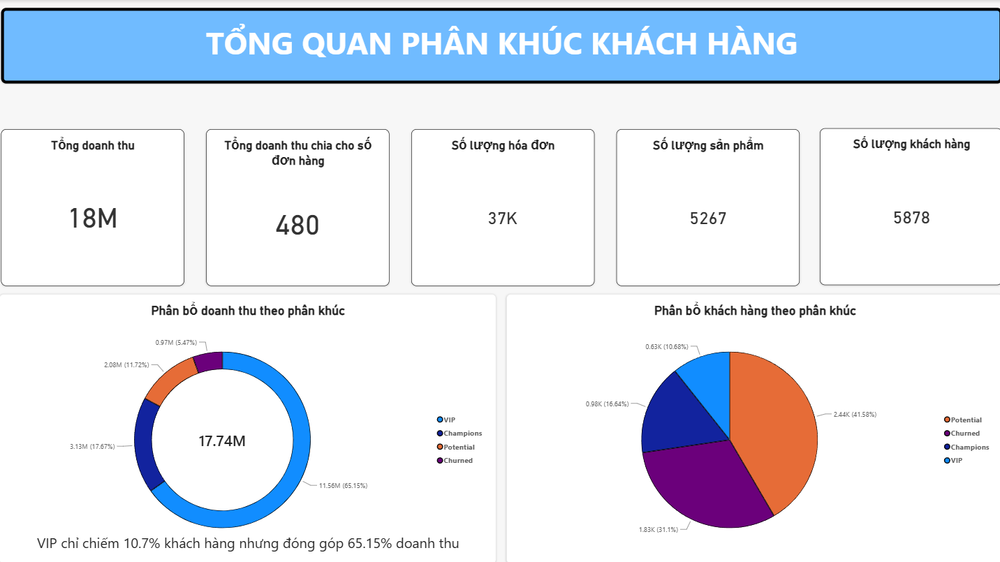
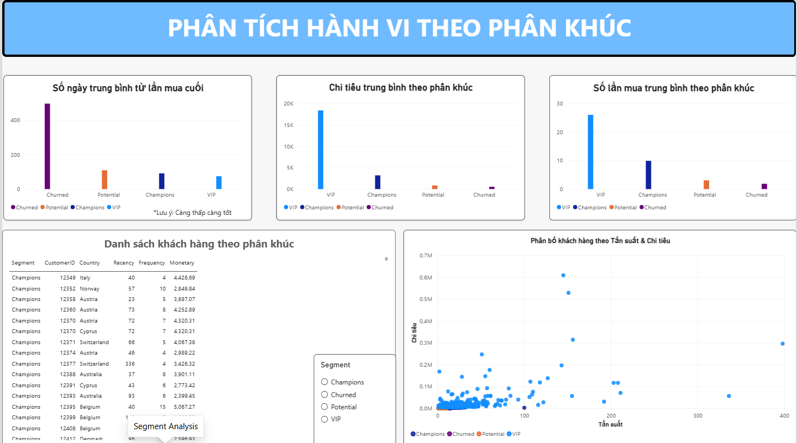
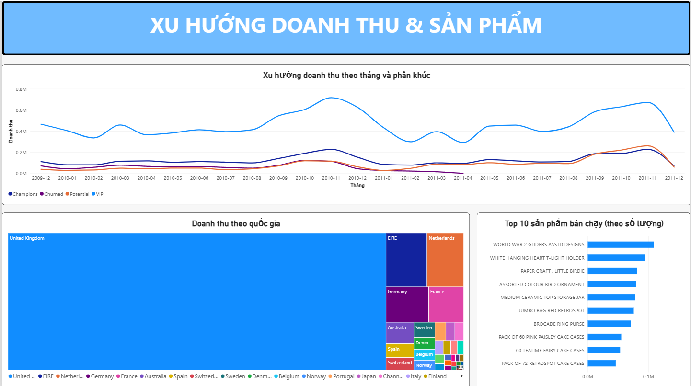

# Customer Segmentation Analysis — Online Retail II

Phân tích và phân khúc khách hàng dựa trên hành vi mua hàng (RFM) cho dữ liệu bán lẻ online, phục vụ mục tiêu tối ưu chiến lược marketing và chăm sóc khách hàng.

## 1. Bài toán kinh doanh

Doanh nghiệp bán lẻ online có hàng nghìn khách hàng nhưng không biết:
- Ai là khách hàng giá trị cao cần giữ chân?
- Ai đang có nguy cơ rời bỏ (churn) cần chiến dịch "win-back"?
- Nên phân bổ ngân sách marketing như thế nào cho hiệu quả?

Project này phân khúc khách hàng thành các nhóm có hành vi tương đồng, làm cơ sở cho chiến lược CRM theo từng nhóm.

## 2. Dữ liệu

- **Nguồn**: [Online Retail II Dataset](https://archive.ics.uci.edu/dataset/502/online+retail+ii) (UCI Machine Learning Repository)
- **Quy mô**: ~1.07 triệu dòng giao dịch, giai đoạn 01/12/2009 – 09/12/2011, khách hàng chủ yếu tại UK và châu Âu
- **Các trường chính**: Invoice, StockCode, Description, Quantity, InvoiceDate, Price, Customer ID, Country

## 3. Quy trình thực hiện

### Bước 1 — Data Cleaning (Python/Pandas)
- Gộp 2 sheet dữ liệu (2009-2010, 2010-2011)
- Loại bỏ ~107K dòng thiếu `Customer ID` (không thể gán giao dịch cho khách hàng)
- Loại bỏ đơn hàng hủy (Invoice bắt đầu bằng "C", tương ứng 100% với Quantity âm)
- Loại bỏ dòng có Price ≤ 0 (lỗi/điều chỉnh hệ thống)
- Tạo cột `TotalPrice = Quantity × Price`

### Bước 2 — RFM Analysis
Tính 3 chỉ số hành vi cho từng khách hàng:
- **Recency**: số ngày kể từ lần mua gần nhất
- **Frequency**: số đơn hàng riêng biệt
- **Monetary**: tổng chi tiêu

Phát hiện outlier rõ rệt ở Monetary (dùng phương pháp IQR) → tách riêng **628 khách hàng "VIP/Wholesale"** (chi tiêu vượt trội, tần suất mua rất cao) khỏi tập phân cụm chính để tránh làm méo kết quả K-means.

### Bước 3 — Customer Segmentation (K-means Clustering)
- Chuẩn hóa dữ liệu bằng `StandardScaler`
- Xác định số cụm tối ưu k=3 bằng phương pháp Elbow (WCSS)
- Phân cụm 5,250 khách hàng còn lại thành 3 nhóm, diễn giải dựa trên đặc điểm trung bình từng cụm

### Bước 4 — SQL
Nạp dữ liệu đã làm sạch vào SQLite, viết các truy vấn phân tích: doanh thu theo phân khúc, số khách hàng theo phân khúc/quốc gia, top sản phẩm bán chạy theo từng nhóm khách hàng.

### Bước 5 — Dashboard (Power BI)
Xây dựng báo cáo 3 trang tương tác: Tổng quan, Phân tích hành vi theo phân khúc, Xu hướng doanh thu & sản phẩm.

## 4. Kết quả phân khúc
   
| Phân khúc | % Khách hàng | % Doanh thu | Đặc điểm |
|---|---|---|---|
| **VIP** | 10.7% | 65.2% | Mua rất thường xuyên, chi tiêu vượt trội (outlier tách riêng bằng IQR) |
| **Champions** | 16.6% | 17.7% | Mua gần đây, tần suất và chi tiêu cao |
| **Potential** | 41.6% | 11.7% | Nhóm đông nhất nhưng đóng góp doanh thu thấp |
| **Churned** | 31.1% | 5.5% | Không quay lại mua hàng đã lâu (trung bình ~495 ngày) |

## 5. Insight & đề xuất kinh doanh
   
- **VIP chỉ chiếm 10.7% khách hàng nhưng đóng góp 65.2% doanh thu** → cần chương trình chăm sóc/loyalty riêng để giữ chân nhóm này, vì rủi ro mất 1 khách VIP ảnh hưởng doanh thu rất lớn.
- **Potential là nhóm đông nhất (41.6%) nhưng đóng góp doanh thu thấp (11.7%)** → tiềm năng lớn cho chiến dịch upsell/cross-sell để chuyển hóa thành Champions.
- **Churned chiếm gần 1/3 tổng khách hàng** → nên triển khai chiến dịch win-back (email nhắc lại, ưu đãi tái kích hoạt) thay vì chỉ tập trung thu hút khách mới.
- UK là thị trường áp đảo về doanh thu; EIRE, Netherlands, Germany là các thị trường quốc tế tiềm năng tiếp theo.
   
## 6. Công cụ sử dụng

- **Python**: Pandas, NumPy, Scikit-learn (StandardScaler, KMeans)
- **SQL**: SQLite
- **Power BI**: Data modeling, DAX, Dashboard design

## 7. Cấu trúc project

```
├── customer_segment.ipynb   # Notebook làm sạch dữ liệu + tính RFM + K-means (chạy trên Kaggle)
├── data_final.csv                   # Dữ liệu giao dịch đã làm sạch
├── rfm_final.csv                    # Bảng khách hàng đã phân khúc
├── customer_segment.pbix                    # File Power BI dashboard
└── README.md
```

> Phần làm sạch dữ liệu và phân cụm (Bước 1–3) được thực hiện trên **Kaggle Notebook** để tận dụng RAM lớn hơn khi xử lý ~1 triệu dòng dữ liệu; phần SQL và Power BI được thực hiện ở local.

## 8. Hướng phát triển tiếp theo

- Thử nghiệm thêm k=4 hoặc các thuật toán phân cụm khác (Hierarchical Clustering) để so sánh
- Xây dựng mô hình dự đoán churn (bài toán phân loại) dựa trên đặc điểm RFM
- Theo dõi dịch chuyển khách hàng giữa các phân khúc theo thời gian (cohort analysis)

---
*Tác giả: Trần Nhất Khương — Sinh viên Hệ thống Thông tin, Đại học Cần Thơ*
